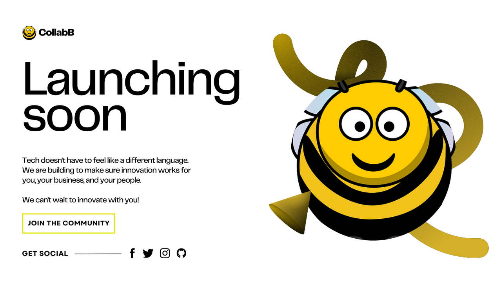

# Project Workflow Documentation - steps.md

## Creating a Workflow for Landing Page Initialization

### Table of Contents

1. [Introduction](#introduction)

2. [How It Started](#how-it-started)

   - 2.1 [Project Initialization](#project-initialization)
   - 2.2 [Persistence and Exploration](#persistence-and-exploration)
   - 2.3 [Discovery on Canva](#discovery-on-canva)

3. [Proposed Design](#proposed-design)

4. [Folder Structure in Visual Studio Code](#folder-structure-in-visual-studio-code)

5. [Current Status](#current-status)

### Introduction

Every project requires a clear and concise documentation of the workflow and steps taken during its development. This documentation, stored in a 'steps.md' file, serves as a valuable resource for not only the original developer but also for others who might join or take over the project. The purpose is to provide insights into the logical work process, making it easier for collaborators to understand and contribute effectively.

### How It Started

### 2.1 Project Initialization
   - **Task:** Initiate the development of a landing page.
   - **Challenge:** No available design to quickly start implementation.
   - **Initial Approach:** Checked Figma for design ideas, but no suitable options found.

### 2.2 Persistence and Exploration:
   - **Decision:** Did not give up on the project despite initial setbacks.
   - **Action:** Continued searching for design inspiration.
   - **Tool Exploration:** Checked Canva as an alternative to Figma.

### 2.3 Discovery on Canva:
   - **Outcome:** Found a suitable design on Canva.
   - **Implementation:** Tweak and adapted the design to fit the project requirements.

### Proposed Design

### Folder Structure in Visual Studio code

### 4.1 Folder Implementation:
   - **Observation:** Analyzed the folder structure of previously completed projects.
   - **Implementation:** Integrated a folder structure based on best practices and insights from past projects.

### Current Status

The project is still ongoing, and further updates will be documented as the development progresses. Stay tuned for more details on the steps taken to bring this landing page project to completion.
